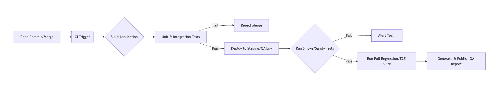

# Google Developer Groups Event Highlights & Workshop Notes

*Date: [Insert Date of Event]*

This page serves as a detailed repository of notes, key takeaways, and resources from the recent GDG event covering AI co-pilots, Agent development, TestOps, and Server-Driven UI.

---

## Workshop 1: AI Colleagues and Co-Pilots

**Speaker:** Karl-Henrik "KH" Nilsson

This session focused on evolving our relationship with AI from simple prompting to treating them as capable teammates through structured guidance and "thinking models."

### Key Takeaways
* **Models Matter:** Different models yield different results. Use thinking models (like GPT-5.2 thinking) for planning and generation, and faster/cheaper models for validation.
* **Iterative Process:** Guiding the AI is crucial. Even "thinking" models need iterative loops to refine context and output.
* **Prompt Engineering as Code:** Treat prompts like software artifacts.
    * **Reusable Prompts:** Store them in a `prompts/` directory or a company-wide library.
    * **Config & Rules:** Clearly define constraints (e.g., "Do not commit secrets," "Prefer async/await").
* **MCP Servers (Model Context Protocol):** A standard for connecting AI models to external data sources (like file systems or web crawlers).

### The "Thinking Model" Workflow

The workshop highlighted moving beyond a single prompt into a multi-step iterative process to improve code generation quality.

-----

## Workshop 2: Agent Developer Kit (ADK)

This workshop explored moving beyond standard chatbots to building "AI Agents"—systems that can reason, plan, and execute tasks using tools.

### Key Takeaways

  * **The Agent Anatomy:**
      * **The Brain:** The LLM (e.g., Gemini) used for reasoning and planning.
      * **The Hands:** Tools, functions, APIs, and databases the agent can interact with.
      * **Orchestration:** The loop that manages memory, state, and executes the plan.
  * **Why ADK?** It provides 10x more control than a simple API call, allowing for state management across multi-step tasks and connecting multiple specialized agents.
  * **Code-First Approach:** ADK allows defining agent logic in Python, Go, or Java, making it testable and version-controlled just like regular software.

### Agent Orchestration Flow

How an agent processes a user request into concrete actions.

**Resources & Links:**

  * **ADK GitHub Repo:** [bukempas/adk-samples](https://www.google.com/search?q=https://github.com/bukempas/adk-samples) *(Note: Verify exact repo link from event if different)*

-----

## Workshop 3: TestOps

This session focused on best practices for modern testing pipelines, emphasizing automation, speed, and the integration of AI into QA.

### Key Takeaways

  * **Test Suites Strategy:**
      * **Smoke Suite:** Is the app stable? (Fast)
      * **Sanity Suite:** Do specific recent changes work? (Targeted, AI can help select these).
      * **Regression Suite:** Did new changes break existing features? (Comprehensive).
      * **E2E Suite:** Do full app workflows function correctly?
  * **Execution Environments:** Shift-left by running tests inside the Dev CI/CD pipeline for immediate feedback, but also maintain independent QA pipelines for deeper regression against staging environments.
  * **AI in TestOps:** AI is boosting TestOps through intelligent test selection (running only what's needed based on code changes), self-healing tests that adapt to minor UI changes, and visual recognition mechanisms.

### Standard TestOps Pipeline Structure

-----

## Workshop 4: Dynamic UI with Firebase & Compose (Server-Driven UI)

This workshop addressed the friction of native app updates by introducing Server-Driven UI (SDUI) using modern tools.

### Key Takeaways

  * **The Problem:** Traditional native development requires app store reviews and user downloads to update UI or logic, leading to misaligned versions across the user base.
  * **The Solution (SDUI):** Decouple the "What" from the "How."
      * **The Server (Backend):** Sends layout and data (what to display).
      * **The Client (App):** Renders the layout using native components (how to display).
  * **The Stack:**
      * **UI Toolkit:** Jetpack Compose (Declarative UI maps easily to remote JSON/XML).
      * **Backend:** Firebase Remote Config (Zero-latency updates and A/B testing capabilities).
      * **Control Plane:** AI Agents + MCP can be used to manage complex configurations.

### Server-Driven UI Flow

